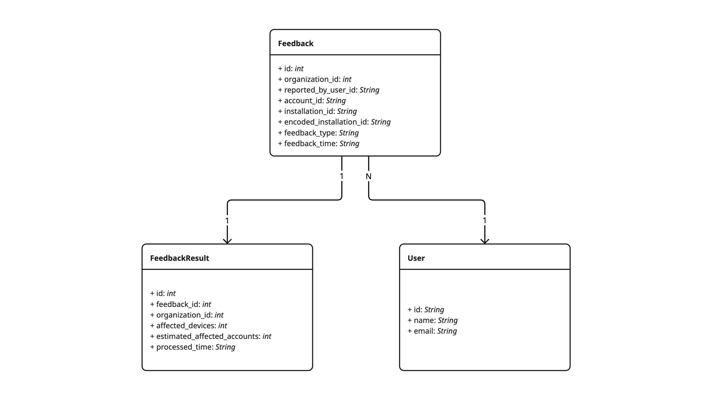

# Feedbacks page server

## Project Summary

Incognia's customers can report feedback to an account or device to control specific cases. The feedback processing is asynchronous, so they don't know the final result right away. For example, how many accounts or devices were affected. To give visibility over this, our product designer proposed an MVP page to list these feedback results.
This project focuses on the server side of this feedback page.

## Requirements

The system must meet the following functional and non-functional requirements. Some of them were directly provided by the problem statement, others were inferred from the context or added to better clarify scope and guarantee a well-designed system.

### Functional requirements

**Index the feedback results**

* Expose a single endpoint that returns a paginated list of feedback results for a given organization.
* Default sort order is `processed_time` descending (most recent first).
* Include the total number of available results so the front-end can compute pages.

The data to be returned should contain:

* `feedback_id`: key from the FeedbackResult table that uniquely identifies each record.
* `processed_time`: moment when the result was processed, taken directly from the FeedbackResult table.
* `feedback_time`: timestamp of the feedback action, read from the joined Feedback record.
* `feedback`: column `feedback_type` from the Feedback record reached through the join.
* `affected_devices`: number of devices impacted, read straight from the FeedbackResult row.
* `estimated_affected_accounts`: number of accounts potentially impacted, read from the FeedbackResult table.
* `account_id`: account associated with the feedback, read from the joined Feedback record.
* `reported_by_id`: identifier of the user who sent the feedback, taken from the joined Feedback record.
* `reported_by`: human-readable name of that user, obtained with a second join from the feedback record to the User table.
* `encoded_installation_id`: field from the joined Feedback record.

**Filtering**

* ID filter: accept one or many `account_id` and/or `encoded_installation_id` values.
* Dates filter: accept a time window that is matched against *both* `processed_time` and `feedback_time`.
* Feedback filter: accept one or many `feedback_type` values (`verified`, `reset`, `account_takeover`, `identity_fraud`).
* All filters are optional and can be combined.

**Tenant isolation**

* Every request carries an `organization_id`.
* The server must guarantee that only data belonging to the provided organisation is ever returned.

**Pagination contract**

* Support `page` and `page_size` parameters.
* Enforce reasonable `page_size` limits to avoid huge scans.

**Validation and error handling**

* Combinations of filters that don't make sense are rejected with a 400 error.
* Unknown `organization_id`s are rejected with a 404 error.

### Non-functional requirements

**Performance**

* The listing endpoint should answer in less than a second under the expected read load (500 requests/day).

**Scalability**

* The chosen datastore must absorb over 10 million insertions per day without affecting read latency.
* Datastorage size over long term should be considered.

**Security**

* Authentication is performed by a middleware and does not need to be considered here.
* Authorization can be trivially checked.

**Observability**

* Emit structured logs for every request (latency, tenant, filters, result count).
* Expose metrics for request count, latency, and error rate.

**Maintainability**

* Keep transport, business, and data-access layers separate to ease future evolution and testing.
* Provide unit tests for query construction and integration tests for the endpoint.

## Questions

Compendium of questions that arose during the design process and are kept here for future reference.

* What is the exact relationship between FeedbackResult and Feedback? Can a single Feedback entry have more than one result?
    - Answer: Each Feedback is associated with a single FeedbackResult.

* Does the solution need to support all three tables (FeedbackResult, Feedback, and User)? Or should it only focus on FeedbackResult?
    - Answer: Depends on the solution chosen. It is important point out the rational behind the answer.

* How many customer organizations will the system serve: tens, hundreds, thousands?
    - Answer: thousands.

* Do we know how the feedbacks are distributed among the organizations? Can we expect it to resemble a uniform distribution? or is it heavily skewed to a few tenants?
    - Answer: It is worth to consider both scenarios and how it would impact the solution.

* Which write operations are performed on the FeedbackResult table? Is it primarily inserts, or are deletes and updates also expected?
    - Answer: It is mainly inserts (10M daily) and reads (500 daily).

* Do we have any information about how often users will be visualizing old feedback results, such as results older than a month?
    - Answer: We can expect that 90% of the requests will be for the last 30 days and the rest will be for data not older than 6 months.

* Could we change the filter design so that each filter has a single, focused responsibility? In practice, this would mean replacing the combined id filter with two separate filters, one for account_id and another for installation_id, and splitting the current date filter into two distinct filters, one for processed_time and another for feedback_time.
    - Answer: Ideally the filters should comply with the business requirements and the solution should be flexible enough to support them.

## Proposed Solution

The main challenge of this project is to design a data model that can handle the write load of the FeedbackResult table while also supporting the read queries and will be tackled first. Later, solutions for the other usual components (API, metrics, monitoring, etc.) will be proposed.
Since complying to an existing application is not a requirement, the solution will discuss possible technologies as if they were already applied in the project and with infrastructure already in place.

### Data Model

PostgreSQL stands out as a reliable and mature open-source relational database system known for its strong adherence to SQL standards, powerful data integrity features, and extensibility. As such, it should be considered for this project.

Below is a UML diagram that shows the relationships between the tables:



To handle the write load of the FeedbackResult table, I propose the usage of partitioned tables. By partitioning the table by `organization_id`, the table is split into smaller tables. This gives several benefits:

* Parallel writes: each partition can be written to in parallel, increasing throughput.
* Horizontal scaling: the database can be scaled horizontally by adding more partitions.
* Improved write performance: each partition can be written to independently, reducing contention.
* Improved read performance: queries are always restricted to a single partition, reducing the amount of data scanned.

The partition should be a hash partition due to the high number of organizations.
The partitions are managed by the database, requiring minimal effort at the application level.
This gives flexibility to scale the database horizontally as the number of organization customers grows or vertically scale giving more connections to increase parallelism.
To take advantage of the parallelism enabled by the partitions a async client should be used.

While indexes greatly improve read performance, is this case, as few indexes as possible should be created to avoid degrading the write performance, for this reason, only the following two indexes are proposed:

* `idx_feedbackresult_feedback_id`: speed up joins with the Feedback table.
* `idx_feedbackresult_processed_time`: speed up queries to be sorted by processed time, very useful since this is the default sort order.

Lacking indexes on filters should not have a big impact on the performance, since the filters are optional and do not impact the initial load.

Below is how the read query should look like, but it may very due to dynamically built filters and ORM usage.

```sql
SELECT 
  r.feedback_id,
  r.processed_time,
  f.feedback_time,
  f.feedback_type,
  r.affected_devices,
  r.estimated_affected_accounts,
  u.name as reported_by,
  f.account_id,
  f.encoded_installation_id
FROM feedback_results r
JOIN feedbacks f ON f.id = r.feedback_id
JOIN users u ON u.id = f.reported_by_user_id
WHERE
  (f.organization_id = $1)
  AND (f.feedback_type = $2 OR $2 IS NULL)
  AND (f.account_id = $3 OR $3 IS NULL)
  AND (f.encoded_installation_id = $4 OR $4 IS NULL)
  AND (f.feedback_time >= $5 OR $5 IS NULL)
  AND (f.feedback_time < $6 OR $6 IS NULL)
  AND (r.affected_devices > $7 OR $7 IS NULL)
  AND (r.processed_time >= $8 OR $8 IS NULL)
  AND (r.processed_time < $9 OR $9 IS NULL)
ORDER BY r.processed_time DESC
LIMIT 50 OFFSET 100;
```

Due to the large amount of data, a long term storage solution should be considered.
If data is not needed for more than 30 days, a simple solution would be to use delete data older than 30 days.
However, if data is needed for a longer period of time, a more robust solution would be to use a data warehouse, such as Amazon S3, to store data older than 30 days and use a query engine, such as Amazon Athena, to query the data.

#### Data Model Alternatives

Using analytics databases, such as Snowflake or ClickHouse, would be great alternatives as they are optimized for this kind of workload.
ClickHouse is specifically built for heavy write workloads and should work out of the box for this project.
However, I would still consider using PostgreSQL as a first option due to it being a more mature technology able to handle several use cases.

To assist the PostgreSQL in handling the write load, a Kafka layer could be added to receive the feedbacks with a Kafka consumer processing the data and writing to the database in batches.

### API

The API is is a simple endpoint that will check Authorization, validate the input then fetch and return the data.

This project is particularly suited for a Graphql API, it allows the client to specify the data it needs while not coupling the server to the client needs.

Below is a graphql query example that would fetch all the data needed to display the feedbacks page:

```graphql
query FeedbackResults(
    $feedbackResultInput: FeedbackResultInput!,
    $feedbackInput: FeedbackInput!,
    $paginationInput: PaginationInput!,
) {
  feedbackResults(input: $feedbackResultInput, pagination: $paginationInput) {
    id
    feedback(input: $feedbackInput) {
        id
        feedbackType
        accountId
        encodedInstallationId
        feedbackTime
        reportedBy {
            id
            name
        }
    }
    processedTime
    affectedDevices
    estimatedAffectedAccounts
  }
}
```

In the query above, the filters are passed as input objects to the query fields.
While graphql may result in more boilerplate code or decreased performance due to n+1 queries, it is a good fit for this project due to the flexibility it provides and the low number of reads.

### API Alternatives

A REST API could be used instead of Graphql resulting in a more straightforward implementation.

## Metrics

The main metrics to monitor are the database write and read throughput and latency.

This can be done per request using a database metrics collector and visualized with an internal dashboard, such as Prometheus and Grafana.

## Monitoring and Alerting

Based on the metrics, alerts can be configured to notify the team when the database performance is degraded.
There should also be alerts for the API status, mainly timeout errors.

## Milestone

For this project, the following milestones are proposed:

* Implementation of the data model.
* Implementation of the metrics collector and internal monitoring.
* Implementation of the alerts.
* Implementation of the API including E2E tests.
